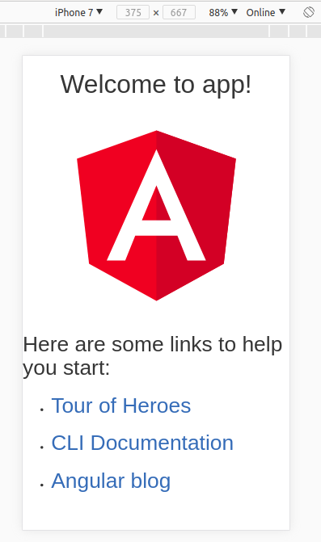
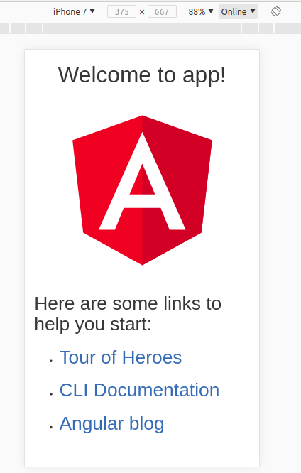
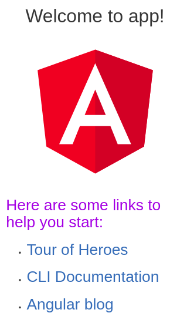
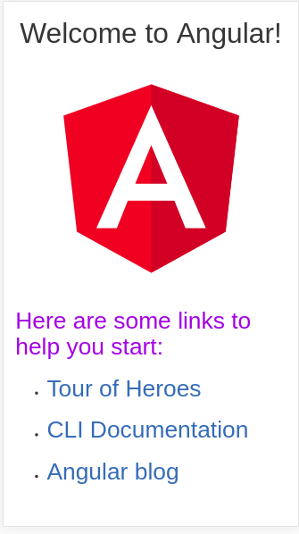
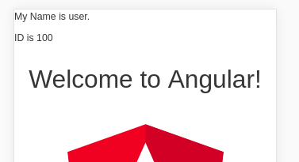

<!--
$theme: gaia
template: gaia
-->

Angular开发基础<p style="text-align:right;font-size:28px;margin-right:50px;color:#cFc;">:star: by calidion</p>
===
---
为什么要学习angular?
===

1. 精良的软件架构
2. 全面的软件测试
3. 完善的组件化方案
4. 庞大的社区支持
5. 代表着未来的技术趋势
6. 已经成熟，并且已经稳定
7. 节约大量的时间
8. 项目的质量可以保证

---
Angular的问题
===
1. 学习成本偏高
2. 架构高端，理解困难
3. 概念多，学习难
4. 项目内容完整，但是太多，会到坏初学者
5. 资料偏少，版本多

---
适合什么样的人群使用？
===
1. 企业用户
2. 对软件质量与软件保证要求高的项目
3. 经验丰富，想快速开发应用
4. 有全面平台开发需求的
5. 想开发功能丰富的SPA应用的
6. 开发PWA或者IONIC应用等

---
1.x 与 2+的区别
===
1. 1.x 与 2+是完全不同的框架
2. 但是2+继承了一些1.x的基本理念
3. 2+是基于TypeScript的，1.x是基于js的
4. 2+是组件化的框架，1.x不是


---
快速上手
===

1. 安装cli
```
npm install -g @angular/cli
```
2. 创建个项目
```
ng new my-app
```
3.  运行项目
```
cd my-app
ng serve --open
```

---

`ng serve --open`里的--open (或者 -o)选项会自动在浏览器打开地址： http://localhost:4200/

4. 修改组件内容
```
// src/app/app.component.ts
export class AppComponent {
  title = 'My First Angular App';
}
```
5. 修改css
```
// src/app/app.component.css
h1 {
  color: #369;
  font-family: Arial, Helvetica, sans-serif;
  font-size: 250%;
}
```

---
项目文件说明
===
1. README.md
介绍了ng命令的基本用法。
包括如何运行项目，如何使用脚手架，如何构建项目，如何测试项目，以及进行E2E测试

2. tsconfig.json
默认的TytpeScript配置，包含了Decorator等支持

3. tslint.json
ts代码的风格规范
`ng lint`时会调用到

---
4. .gitignore
git忽略的文件

5. .editorconfig
编辑配置信息

6. .angular-cli.json
angular cli 配置信息

7. karma.conf.js
Angular测试框架Karma的测试配置

8. protractor.conf.js
E2E测试框架protractor的配置

9. src
angular源码

---
源码目录介绍
===
1. app目录
存放应用代码的地方，大部分的代码都在这里编写

2. assets目录
存放常规文件的地方

3. environments目录
存放环境配置的地方

4. favicon.ico
网站图标

5. index.html
默认的访问文件

---

6. main.ts
默认的angular调用脚本文件，是编译器编译的文件，也是根模块(Root Module)加载的地方。

7. polyfills.ts
一个用于normalize浏览器差异的文件。

8. styles.css
全局的样式

9. test.ts
单元测试的进入点(Entry Point)

10. tsconfig.{app|spec}.json
Angular应用的TypeScript编译配置信息，.app.json作用于应用， .spec.json作用于测试

---
测试ng框架
===

执行

```
ng test
```
既可对框架进行测试。

- ng测试通常需要有默认的浏览器。
一般使用Chrome来测试。
对于ubuntu，一般使用chromium-browser。所以可以使用下面的命令安装：
```
sudo apt-get install chromium-browser
```

---

这里通常还需要配置一下CHROME_BIN参数

```
export CHROME_BIN=chromium-browser
```
通常我们可以测试正确并得到结果如下：
```
 10% building modules 1/1 modules 0 active16 12 2017 16:12:34.282:WARN [karma]: No captured browser, open http://localhost:9876/
16 12 2017 16:12:34.296:INFO [karma]: Karma v1.7.1 server started at http://0.0.0.0:9876/
16 12 2017 16:12:34.296:INFO [launcher]: Launching browser Chrome with unlimited concurrency
16 12 2017 16:12:34.306:INFO [launcher]: Starting browser Chrome
16 12 2017 16:12:44.779:WARN [karma]: No captured browser, open http://localhost:9876/  
16 12 2017 16:12:45.275:INFO [Chromium 63.0.3239 (Ubuntu 0.0.0)]: Connected on socket uxM1um9TOvv91w20AAAA with id 1347711
Chromium 63.0.3239 (Ubuntu 0.0.0): Executed 3 of 3 SUCCESS (0.393 secs / 0.365 secs)
```

---
生成一个项目
===
```
ng build --prod
```
--dev	默认
--prod	表示生产环境

---
使用bootstrap
===

1. 安装npm模块
```
npm install ngx-bootstrap --save
```

2. 添加css地址到index.html
```
// v3
<link href="https://maxcdn.bootstrapcdn.com/bootstrap/3.3.7/css/bootstrap.min.css" rel="stylesheet">

// v4:
<link href="https://maxcdn.bootstrapcdn.com/bootstrap/4.0.0-beta/css/bootstrap.min.css" rel="stylesheet">
```
---
组件化技术
===
组件化技术是指将
1. HTML（结构，数据，模板等技术）
2. CSS（SCSS/Sass/Stylus/Less）
3. JS（框架，HTTP访问，WS等）

等以模块的方式组织起来的技术。

polymer是最早的组件化方案。
react是最早流行起来的组件化框架。
anglar是目前最完善的组件化框架

---
最完善的组件化框架
===

在所有的组件化技术方案中，Angular是最完善的。
三个部分的分离是最彻底的。
每个文件都是独立存放的。
分别是：
1. xxx.html
2. xxx.css/xxx.scss
3. xxx.ts

这三种。比如我们这里默认的app组件，有app.component.html, app.component.css, app.component.ts这三种文件。

---
对App组件的结构的修改
===
根据我们对HTML作用的理解
修改结构也就是对HTML文件的修改
也就是对`app.component.html`文件的修改。


基于我们刚才添加了bootstrap
所以我们就可以将bootstrap里面的grid添加到HTML里面去

---


因此我们可以这样修改模板：
```
<div class="container">
  <div class="row">
    <div class="col-md-12">
    // 原内容
    ...
    </div>
  </div>
</div>
```

---
|  |  |  边距发生了变化 | 
| :---: | :---: | :---: |
| 之前 | 之后 |  说明 |

---

这时我们得到结构的变化如上。
添加后内容有了边距。 

除了可以修改组件html外，我们还可以修改CSS样式。

下面我们一起来修改一下CSS的样式。

---

CSS样式修改
===
与HTML修改类型，CSS样式所对应的文件是:

```
app.component.css
```
添加CSS代码：
```
h2 {
    color: blueviolet;
}
```
就可以修改掉h2的样式。

---
效果如下：
| [](./images/css-bs.png) | <= <br/>h2已经变成紫色，即<br/>`Here are seom links to help you start`<br/>部分 |
| --- | --- |

---
通过脚本修改展现内容
===
对应的脚本文件是：
```
app.component.ts
```
修改其中的
```
  title = 'app';
```
为
```
  title = 'Angular';
```

---

|  |  标题从<br/>"Welcome to app" <br/>变成是 <br/>"Welcome to Angular" |
| --- | --- |

---
在文件`app.components.html`里，我们找到了这个代码：
```
          Welcome to {{ title }}!
```
可见`{{ title }}`就是用来替换title变量所对应的字符串的。
当我们修改title值的时候，title展示的内容就是跟关变化。
这就是最基本的angular模板与变量的值的绑定方式。
这时我们调用
```
ng test
```
会报错。所以需要重新调用测试代码才能恢复正确。

---
进一步分析app.component.ts
===
app.component.ts文件的原始内容是：

```ts
import { Component } from '@angular/core';

@Component({
  selector: 'app-root',
  templateUrl: './app.component.html',
  styleUrls: ['./app.component.css']
})
export class AppComponent {
  title = 'app';
}
```
---
其中@Component是Decorator(装饰器)。
用于声明class AppComponent是一个组件。

组件的参数里包含了三个东西：

1. `selector: 'app-root'`
是这个组件的选择器名称
也是组件内的所有HTML的父容器

2. `templateUrl: './app.component.html'`
模板url，对应的是模板的位置信息
3. `styleUrls: ['./app.component.css']`
样式对应的信息，可以添加多个样式文件。

---
创建新的组件
===
```
ng generate component new-component
```
这时会有app目录下面生成`new-component`目录。
里面包含有四个文件:
三个是组件文件，一个是测试文件
并且在.ts文件里多了
1. 一个构造函数constructor
2. 一个初始化函数ngOnInit

---
将新组件加入到app页面中来
===
找到app.component.html
可以在任意的地方加入
```
<app-new-component></app-new-component>
```
这样新的组件就可以在app.component.html使用起来了。

---
添加到index.html
===

如果你想在index.html里添加组件，需要在
`app.module.ts`里添加一下。
找到`@NgModule`里面的`bootstrap`属性，修改如下：

```ts
bootstrap: [AppComponent, NewComponentComponent]
```
这样`app-new-component`组件就可以添加进去了。

---
添加属性到组件
===
比如：

```ts
name = 'user';
id = 100
```

那么这时就可以在.html文件里添加对name和id的处理如下：

```html
<p>My Name is {{ name }}.</p>
<p>My ID is {{id}}</p>
```
---
得到结果如下：


---
创建一个类存放name和id
===
将下面的代码放入`new-component`目录的`user.ts`文件中。

```ts
export class User {
    id: number;
    name: string;
};
```

然后导入到组件的.ts文件里

```ts
import { User } from './user'
```
---
将name,id修改一个User对象, 代码如下：

```ts
import { Component, OnInit } from '@angular/core';
import { User } from "./user"

@Component({
  selector: 'app-new-component',
  templateUrl: './new-component.component.html',
  styleUrls: ['./new-component.component.css']
})
export class NewComponentComponent implements OnInit {
  user: User = {
    name: 'Eric',
    id: 1
  };
  constructor() {
  }
 ngOnInit() {
  }
}
```
---
这时name和id的显示消失，需要修改一个.html文件如下。

```html
<p>My Name is {{ user.name }}.</p>
<p>My ID is {{user.id}}</p>
```
这时内容将会更新到新的值，并显示出来。

---
使用管道(Pipe)
===
有时候对于字符串，我们还会有一些固定处理。比如全部大写或者全部小写。

那么这个时候可以使用管道(Pipe)来实现，Angular内置了很多管道，比如：uppercase/lowercase。

对于上面的情况，如果我们想让名字变成是大写，只需要这样写代码：
```html
<p>My Name is {{ user.name | uppercase}}.</p>
<p>My ID is {{user.id}}</p>
```
---
双向绑定
===
向.html里添加如下代码。
```
<div>
    <label>name:
      <input [(ngModel)]="user.name" placeholder="name">
    </label>
</div>
```

当添加(ngModel)后，程序就会出错。

原因是ngModel是属于FormsModule的。
而默认我们并没有添加。

---
添加(ngModel)支持
===

1. 打开app.module.ts文件

2. 将FormsModule引入进来，代码如下：

```ts
import { FormsModule } from '@angular/forms';
```
3. 并添加到imports里面。代码如下：

```
imports: [
  BrowserModule,
  FormsModule
],
```
保存后，双向绑定的功能就可以使用了。

---
组件的使用
===
在Angular中，所有的组件的使用都必须要在app.module.ts里初始化。
ng 工具可以帮我们进行初始化，如果是手工添加的组件，一定不能忘记添加组件到app.module.ts里去。
打开app.module.ts，我们发现了它对NewComponentComponent的处理。
1. 导入NewComponentComponent
```
import { NewComponentComponent } from './new-component/new-component.component';
```

---

2. 在NgModule里被声明

```ts
  declarations: [
    AppComponent,
    NewComponentComponent
  ],
```
这样NewComponentComponent就可以正常的使用了。

---
使用\*ngFor处理数组数据
===
在组件.ts文件里添加数组属性
```
user: User[] = [
  { id: 11, name: 'Mr. Nice' },
  { id: 12, name: 'Narco' },
  { id: 13, name: 'Bombasto' },
  { id: 14, name: 'Celeritas' },
  { id: 15, name: 'Magneta' },
  { id: 16, name: 'RubberMan' },
  { id: 17, name: 'Dynama' },
  { id: 18, name: 'Dr IQ' },
  { id: 19, name: 'Magma' },
  { id: 20, name: 'Tornado' }
];
```
---
并在.html文件里添加：
```
<table>
  <tr *ngFor="let u of users">
    <td>{{u.name}}</td>
    <td>{{u.id}}</td>
  </tr>
</table>
```

这样我们就能将所有的用户列举出来了。

---
添加事件绑定
===
在上面的tr元素上添加
```
 (click)="onSelect(u)"
```
并在.ts文件里添加onSelect方法如下
```
  onSelect(user) {
    console.log("user clicked");
    console.log(user);
  }
```
---
点击更新
===
user属性我们现在不再需要，我们引入selectedUser来取代user，并让原来的展示信息可以跟随点击变动。
所以我们删除user属性，改为selectedUser属性。
并将.html里的u换成是user。
这时将处理方法也修改一下如下：

```ts
  onSelect(user) {
    this.selectedUser = user;
  }
```

---
\*ngIf去除
===
一开始我们的selectedUser是没有的。所以这时浏览器会报错。
为了消除错误，我们可以使用\*ngIf。代码如下：

```html
<div *ngIf="selectedUser">
  <p>My Name is {{ selectedUser.name | lowercase }}.</p>
  <p>My ID is {{selectedUser.id}}</p>
  <div>
    <label>name:
      <input [(ngModel)]="selectedUser.name" placeholder="name">
    </label>
  </div>
</div>
```

---
样式修改
===
添加.selected样式表示修改
```
.selected {
    color: red;
}
```
添加下面的代码到tr元素
```
  [class.selected]="user === selectedUser"
```
这时当选择一个用户时，该用户信息会显示出来，并且列表行里会显示成红色。

---
类绑定
===
代码：
```
[class.selected]="user === selectedUser"
```
是Angular中的类绑定。
当user === selectedUser时，
这个.selected属性就会生效。

---
用户详情组件化
===

这里我们将用户列表与详情放到了一起。如果用户的详情能独立出来，我们可以更加好的复用起来，可能是一个更加良好的设计方案。

所以我们可以考虑将详情独立出来。

我们可以使用

```bash
ng generate component user
```
生成相关的组件。

---
添加@Input的属性接收数据
===
1. 导入Input
```
import { Component, OnInit, Input } from '@angular/core';

```
2. 向组件里添加属性user，同是给它一个@Input()

```
  @Input() user;
```

---

3. 从外部组件接收数据

将代码
```
<app-user [user]="selectedUser"></app-user>
```
放入外部组件。

其中[user]="selectedUser"是属性绑定。

---
属性绑定
===
1. 绑定已经有的属性
```

```
2. 绑定自定义的属性
```
<app-user [user]="selectedUser"></app-user>
```

---
服务(Services)
===
组件本身只是表达一个UI与数据为主的HTML元素。
但是它不适合处理数据的获取与保存等工作。
因为它有必要将这类工作交给服务(Service)来处理。

---
创建UserService
===
执行：
```
ng generate service user
```

---

并添加getUsers函数如下：
```
  getUsers(): User[] {
    return [
      { id: 11, name: 'Mr. Nice' },
      { id: 12, name: 'Narco' },
      { id: 13, name: 'Bombasto' },
      { id: 14, name: 'Celeritas' },
      { id: 15, name: 'Magneta' },
      { id: 16, name: 'RubberMan' },
      { id: 17, name: 'Dynama' },
      { id: 18, name: 'Dr IQ' },
      { id: 19, name: 'Magma' },
      { id: 20, name: 'Tornado' }
    ];
  }
```
---
将service添加到AppModule里
===
1. 导入
```
import { UserService } from './user.service';
```

2. 添加

```
  providers: [UserService],
```
这样就可以在任何一个地方被类注入使用。

---
使用Service更新数据
===
在new-component应用中
1. 导入
```
import { UserService } from "../user.service"
```
2. 将数据清空
```
  users: User[]；
```
---

3. 依赖注入UserService
```
  constructor(private userService: UserService) {
  }
```
当组件创建时，就会被注入UserService的单例。

4. 创建函数来接收数据

```
getUsers(): void {
  this.users = this.userService.getUsers();
}
```

---
5. 在ngOnInit里调用
在构造里调用有时候会降低创建的性能，特别是不能执行异步操作。
所以异步，远程等初始化代码最好移到ngOnInit里。
代码如下：
```
  ngOnInit() {
    this.getUsers();
  }
```

---
可观察的数据(Observable Data)
===
在Angular中，所有的远程数据都是可观察的数据。
使用HttpClient.get获取，并返回Observable对象。
Observable是RxJS库的主要类。

下面让getUsers也是Observable的：

1. 导入Observable和of
```
import { Observable } from 'rxjs/Observable';
import { of } from 'rxjs/observable/of';
```

---

2. 变成Observable的返回

```
  getUsers(): Observable<User[]> {
    return of([
      { id: 11, name: 'Mr. Nice' },
      { id: 12, name: 'Narco' },
      { id: 13, name: 'Bombasto' },
      { id: 14, name: 'Celeritas' },
      { id: 15, name: 'Magneta' },
      { id: 16, name: 'RubberMan' },
      { id: 17, name: 'Dynama' },
      { id: 18, name: 'Dr IQ' },
      { id: 19, name: 'Magma' },
      { id: 20, name: 'Tornado' }
    ]);
  }
```

---
3. 在目标组件被订阅(Subscribe)

```
  getUsers(): void {
    this.userService.getUsers().subscribe((users) =>
     this.users = users);
  }
```

这时组件又恢复正常。

---
从服务器获取数据
===
1. 引入HttpClient
```
import { HttpClient, HttpHeaders } from '@angular/common/http';
```

2. 将HttpClient注入到UserService中
```
  constructor(
    private http: HttpClient
  ) { }
```
。

---

3. 添加HttpClientModule到app.module.ts

这时会报找不到HttpClient找不到的错误，这时我们需要添加HttpClientModule
```
import { HttpClientModule } from '@angular/common/http';
```

然后再添加到imports中：
```
  imports: [    HttpClientModule
  ]
```

这样我们的数据获取就成功了。

---
路由的使用
===
路由的作用是让Angular的页面可以进行方便的切换。
对于Angular来讲，路由通常应该：

1. 定义一个顶级，独立的模块(Module)用于路由
2. 在根模块(root Module)里加载

---
自动创建Module
===
使用ng命令可以很方便的完成。

```
ng generate module app-routing --flat --module=app
```
其中：
--flat 将文件直接放在src/app目录，而不是新建目录
--module=app 告诉命令行注册模块到AppModule的imports里面去

---
添加路由模块并导出
===
1. 添加模块

```
import { RouterModule, Routes } from '@angular/router';
```

2. 导出模块Module
```
@NgModule({
  exports: [ RouterModule ]
})
```

这样路由的指令就可以被AppModule使用了

---
添加路由
===
Routes是专门用来添加路由信息的。
Routes是Route的数组。

Route通常包括两个属性：
1. path: 与浏览器URL匹配的路径
2. component: 路径对应的组件

---
添加路由到`app-routing.module.ts`文件。

```
const routes: Routes = [
  { path: 'users', component: NewComponentComponent }
];
```
---
启动URL路径的识别
===

添加
```
RouterModule.forRoot()
```
到`app-routing.module.ts`文件里，得到
```
imports: [ RouterModule.forRoot(routes) ],
```

---
添加 RouterOutlet
===
将`app.component.html`文件里的`app-new-component`组件

```
<app-new-component></app-new-component>
```
替换成
```
<router-outlet></router-outlet>
```
在RouterModule通过AppRoutingModule添加到AppModule后，RouterOutlet是其中一个可以获取得到的指示符之一。

---

添加routerLink
===

在app.component.html里添加

```
<a routerLink="/users">
  用户列表
</a>
```
这时点击`用户列表`就可以获取到列表数据了。

---
添加多个路由
===
添加多个路由的前提是有多个组件。所以我们先添加几个组件
```
ng generate component basic
```
然后将BasicComponent添加到routes变量中，得到：

```
const routes: Routes = [
  { path: 'users', component: NewComponentComponent },
  { path: 'basic', component: BasicComponent }
];
```

---

添加
```
<a routerLink="/basic">
  基本
</a>
```
到`app.component.html`文件后，我们就可以有两个路径选择了。

---
添加默认路径
===
这时可以选择两个组件的URL作为默认路径。
假设我们选择basic为默认路径，我们添加下面的代码到routes里面去。

```
{ path: '', redirectTo: '/basic', pathMatch: 'full' },
```

这样默认打开页面就会跳转到`/basice`

---